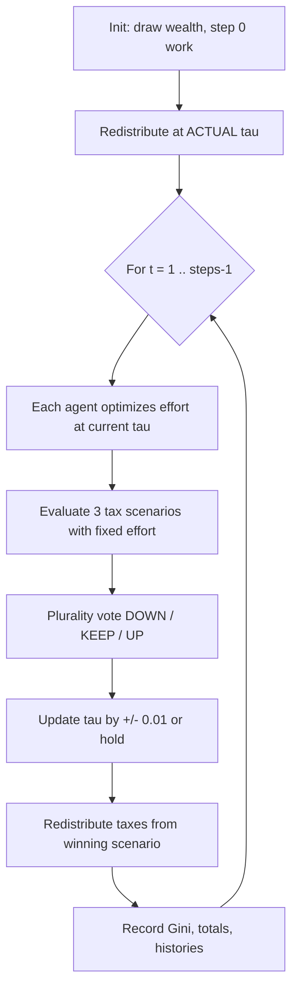
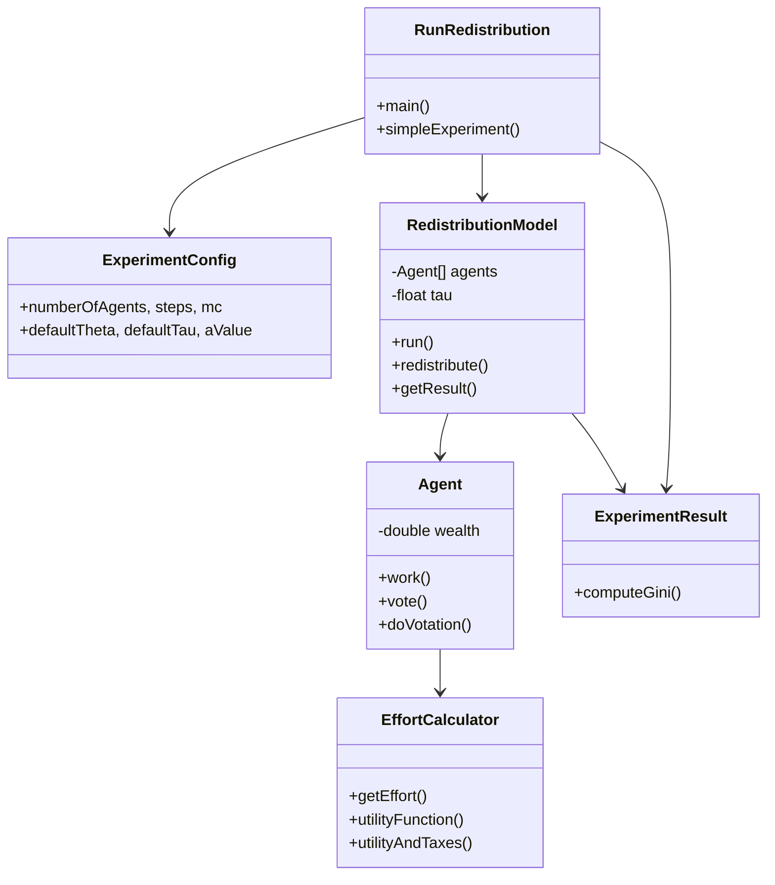

# Redistribution model

Agent-based simulation where heterogeneous agents choose labor effort, vote on the tax rate, and receive equal per-capita redistribution of tax revenue. The project runs many Monte Carlo simulations in parallel, exports results as semicolon-separated CSV files, and can generate plots via optional Python scripts.

## Requirements

- Java 11+ (Maven `release` is 11; newer JDKs are supported for compilation)
- Maven 3.x
- Python 3 (optional, for plots under `pylib/`)

## Build

```bash
mvn compile
```

## Main entry point: `RunRedistribution`

Class: `script.RunRedistribution`

### Command line

```text
java script.RunRedistribution <outputDirectory> <config.json>
```

| Argument | Description |
|----------|-------------|
| `outputDirectory` | Base folder for results. On Windows a trailing `\` is appended automatically. |
| `config.json` | Path to an experiment definition (see `instances/`). |

The program creates a subfolder named after the config file (without `.json`), e.g. `experiments\sigma05-grid\` when using `instances/sigma05-grid.json`.

### Execution flow

1. **Load configuration** — JSON is parsed into `ExperimentConfig` (Gson). Missing keys keep Java default values.
2. **Choose mode** — `executionType` in the JSON:
   - **`SIMPLE`** — one parameter set, full history export, optional line plots.
   - **`GRID`** — nested loops over parameter ranges; heatmaps at the end.
   - **`PAIRS`** — removed; throws an error if selected.
3. **Run simulations** — `simpleExperiment` launches `mc` independent `RedistributionModel` instances on a thread pool (`availableProcessors - 1` threads).
4. **Write CSVs** — aggregated matrices (one row per Monte Carlo replication, one column per time step).
5. **Optional Python** — line plots (SIMPLE) or heatmaps (GRID) via `PythonRunner`.

### Configuration file (`ExperimentConfig`)

Example minimal SIMPLE run (`instances/default-simple.json`):

```json
{
  "numberOfAgents": 1000,
  "steps": 100,
  "mc": 50,
  "defaultTheta": 0.1,
  "defaultTau": 0.1,
  "aValue": 10,
  "mu": 0.0,
  "sigma": 0.5,
  "executionType": "SIMPLE"
}
```

| Field | Role |
|-------|------|
| `numberOfAgents` | Population size per replication |
| `steps` | Number of time steps |
| `mc` | Monte Carlo replications |
| `defaultTheta` | Preference parameter θ (leisure vs. consumption) |
| `defaultTau` | Initial / fixed tax rate τ |
| `aValue` | Effort-cost scale *a* (Java default: **1**; example configs often use 10) |
| `mu`, `sigma` | Log-normal parameters for initial wealth |
| `maxEffort` | Upper bound when optimizing effort (default 10) |
| `executionType` | `SIMPLE`, `GRID`, or `PAIRS` |
| `printResult` | Log each replication summary |
| `runPythonScripts` | After SIMPLE: run line plots |
| `exportGini` | In GRID: write `stepgini_*.csv` per grid point (SIMPLE always exports Gini) |

**GRID mode** (`executionType`: `"GRID"`) additionally uses:

| Field | Role |
|-------|------|
| `initialTheta`, `incTheta`, `maxTheta` | Sweep range for θ |
| `initialTau`, `incTau`, `maxTau` | Sweep range for τ (when `useA` is false) |
| `initialA`, `incA`, `maxA` | Sweep range for *a* (when `useA` is true) |
| `useA` | `true` → grid over θ and *a*; `false` → grid over θ and τ (Java default: **true**) |

Monte Carlo replications are limited to **125** (`PRIME_SEEDS` length in `RedistributionModel`); set `mc ≤ 125`.

For θ–τ grids, existing output files matching `{theta}_{tau}_*` are skipped so long runs can be resumed.

Generate a template JSON with defaults:

```bash
mvn -q exec:java -Dexec.mainClass="script.ExperimentConfigGenerator" -Dexec.args="instances/my-config.json"
```

(Or run the class from your IDE with the output path as the sole argument.)

### Output files

Each call to `simpleExperiment` writes files under the experiment folder with a suffix `{theta}_{tau}_{timestamp}.csv` (formatted to two decimals).

| Prefix | Content |
|--------|---------|
| `tau_` | Tax rate τ over time (one row per MC replication) |
| `wealth_` | Sum of per-agent recorded income per step (net utility + redistribution; not cumulative wealth) |
| `effort_` | Total population effort per step |
| `stepgini_` | Gini coefficient per step (always in SIMPLE; in GRID when `exportGini` is true) |
| `voteDownHistory_`, `voteKeepHistory_`, `voteUpHistory_` | Vote counts per step (SIMPLE with history) |
| `effortHistory_*`, `salaryHistory_*`, `voteHistory_*` | Per-agent series (SIMPLE only) |

CSV format: semicolon separator, no quote character.

After a **GRID** run, `PythonRunner` generates heatmaps for `wealth`, `tau`, and `effort` from the collected CSVs.

After **SIMPLE** with `runPythonScripts: true`, line plots are produced for `tau`, `wealth`, and `stepgini`.

## Simulation model

### Overview

The model is a **non-spatial, well-mixed** agent-based simulation. A population of `N` agents (`numberOfAgents`) interacts only through **aggregate voting** on the tax rate; there are no pairwise or spatial interactions.

Within a replication, all agents share the same preference parameters (θ, *a*). **Heterogeneity comes solely from initial wealth**, drawn once per agent from a log-normal distribution LogNormal(μ, σ). The only global state is the tax rate **τ ∈ [0, 1]**, adjusted in discrete steps of **δ = 0.01** (`TAU_INCREMENT`).

Each time step follows this cycle: labor effort choice → tax aggregation under three counterfactual tax rates → collective vote → tax-rate update → equal per-capita redistribution → inequality and aggregate metrics.

**Key modeling assumption:** agent `wealth` is set at initialization and **never updated** during the run. Effort optimization always uses this fixed draw. Recorded “income” in outputs is a **flow measure** (net utility plus redistribution), not a persistent wealth stock.



### Economic primitives

Preferences and taxes are defined in `EffortCalculator`.

**Cobb–Douglas composite (pre-tax):**

\[
C(w, e) = w^{1-\theta} \cdot e^{\theta}
\]

**Net utility** (maximized over effort *e* each step):

\[
U(e) = (1 - \tau)\, C(w, e) - \frac{e^2}{2a}
\]

| Symbol | Config field | Meaning |
|--------|--------------|---------|
| *w* | — | Initial wealth (log-normal draw, fixed for the run) |
| *e* | — | Labor effort (chosen each step) |
| θ | `defaultTheta` | Cobb–Douglas weight on effort vs. wealth |
| *a* | `aValue` | Effort-cost scale (higher *a* → lower disutility of effort) |
| τ | `defaultTau` | Tax rate applied to the Cobb–Douglas term |

**Tax contribution** per agent under a given scenario:

\[
T = \frac{U_{\text{net}} \cdot \tau}{1 - \tau}
\]

where \(U_{\text{net}}\) is the value returned by `utilityFunction` (already net of tax and effort cost). The code stores \(U_{\text{net}}\) in `Agent.salary[]` — this is **net utility**, not a monetary wage.

**Effort optimization:** Nelder–Mead simplex on [0, `maxEffort`] with initial guess 1.0 (max 1000 evaluations). On failure, a grid search from 0 to `maxEffort` in steps of 0.01 selects the best effort level.

The first-order condition (not used directly in code, but equivalent to the interior optimum) is:

\[
\frac{\partial U}{\partial e} = (1-\tau)\,\theta\, w^{1-\theta}\, e^{\theta-1} - \frac{e}{a} = 0
\]

### Time-step mechanics

**Step 0 (initialization — no vote):**

1. Sample \(w_i \sim \text{LogNormal}(\mu, \sigma)\) for each agent (RNG seed: `PRIME_SEEDS[mcIteration]`).
2. Each agent optimizes effort at the starting τ and computes salary/taxes for three scenarios (τ − δ, τ, τ + δ).
3. Taxes collected under the **ACTUAL** scenario are redistributed equally; Gini and population aggregates are recorded.

**Steps 1 … steps − 1 (`RedistributionModel.run()`):**

1. **Work** — each agent re-optimizes effort at the current τ and evaluates all three tax scenarios using **the same fixed effort** (agents do not re-optimize under counterfactual tax rates when voting).
2. **Vote** — each agent selects the scenario that maximizes post-redistribution payoff.
3. **Update τ** — plurality rule adjusts τ by ±δ or leaves it unchanged.
4. **Redistribute** — the tax pool from the **winning** scenario is split equally among all agents.
5. **Record** — per-agent income, total effort, total income, and Gini coefficient.

```
INIT (t = 0):
  τ ← startTau
  for each agent i:
    w_i ~ LogNormal(μ, σ)          // fixed for entire run
    e_i ← argmax_e U(e; w_i, τ)
    compute (salary_i,k, tax_i,k) for k ∈ {DOWN, KEEP, UP}
  redistribute using tax pool k = ACTUAL

FOR t = 1 TO steps - 1:
  for each agent i:
    e_i ← argmax_e U(e; w_i, τ)
    evaluate scenarios k with fixed e_i
  share_k ← (Σ_i tax_i,k) / N
  each agent i votes for argmax_k (share_k + salary_i,k)
  outcome ← plurality(votes)       // KEEP wins ties
  τ ← τ ± δ or unchanged
  income_i ← salary_i,winner + share_winner
  record Gini(income), Σ effort, Σ income
```

### Voting and redistribution

**Individual vote** (`Agent.vote`):

\[
\text{vote}_i = \arg\max_{k \in \{\text{DOWN}, \text{KEEP}, \text{UP}\}} \left( \frac{\sum_j T_{j,k}}{N} + \text{salary}_{i,k} \right)
\]

**Plurality rule** (`Agent.doVotation`):

- **DOWN** wins if `voteDowns > voteKeeps && voteDowns > voteUps`
- **UP** wins if `voteUps > voteKeeps && voteUps > voteDowns`
- Otherwise **KEEP** (including all ties)

**Redistribution** (`RedistributionModel.redistribute`):

\[
\text{redistributed} = \frac{\sum_i T_{i,\text{winner}}}{N}, \quad \text{income}_i = \text{salary}_{i,\text{winner}} + \text{redistributed}
\]

Redistribution uses the tax pool of the **winning vote scenario**, not necessarily the pre-vote ACTUAL pool.

### Inequality metric

The Gini coefficient is computed via the relative mean absolute difference (`ExperimentResult.computeGini`):

\[
G = \frac{1}{2} \cdot \frac{\sum_{i \neq j} |x_i - x_j|}{(n-1)\,\sum_i x_i}
\]

where \(x_i\) is the per-agent recorded income at step *t*.

### Component architecture

| Class | Package | Role |
|-------|---------|------|
| `RedistributionModel` | `redist` | ABM engine: initialization, time loop, τ updates, redistribution, aggregates |
| `Agent` | `redist` | Effort choice, counterfactual tax evaluation, voting |
| `EffortCalculator` | `util` | Cobb–Douglas utility, tax formula, Nelder–Mead + grid fallback |
| `ExperimentResult` | `util` | Result container, Gini computation, CSV formatting |
| `RunRedistribution` | `script` | CLI orchestrator, parallel MC runs, CSV I/O, GRID sweeps |
| `ExperimentConfig` | `script` | JSON-deserializable experiment parameters |



Implementation notes:

- A single shared `EffortCalculator` instance is injected into all agents within a replication.
- RNG seed per replication: `PRIME_SEEDS[mcIteration]` (deterministic, up to 125 replications).
- `Agent.endStep()` tracks whether an agent ever changed its vote after the first voting step; this flag is computed but **not exported** to CSV.

### Parameter effects

| Parameter | Effect on dynamics |
|-----------|-------------------|
| Higher θ | More weight on effort in Cobb–Douglas → typically higher optimal effort |
| Higher τ | Lower net utility, larger tax pool, shifts voting incentives toward redistribution |
| Higher *a* | Lower effort disutility → higher effort supply |
| Higher σ | More initial wealth dispersion → higher starting inequality |
| Higher *N* | Smoother aggregate voting; per-capita redistribution shares less volatile |
| Higher `maxEffort` | Wider search range for optimal effort (default 10) |

## Other utilities

| Class | Purpose |
|-------|---------|
| `ExperimentConfigGenerator` | Writes default JSON to a path |
| `RunEurozoneValues` | Reads `country;mu;sigma` CSV and runs a fixed grid per country |
| `PythonPlotsTest` | JUnit hooks to test Python heatmaps locally |

## Project layout

```text
src/
  script/     RunRedistribution, ExperimentConfig, batch runners
  redist/     RedistributionModel, Agent
  util/       ExperimentResult, EffortCalculator, FileUtils, PythonRunner
  test/       Python integration tests
instances/    Sample JSON configurations
experiments/  Typical output location (created at runtime)
pylib/        Python plotting scripts (external to Maven)
```

## Example

```bash
mvn -q compile
java -cp target/classes:... script.RunRedistribution experiments instances/default-simple.json
```

Adjust the classpath to include Maven dependencies (Gson, OpenCSV, Commons Math, SLF4J, etc.) or configure an exec plugin / IDE run configuration pointing at `script.RunRedistribution` with the two arguments above.
